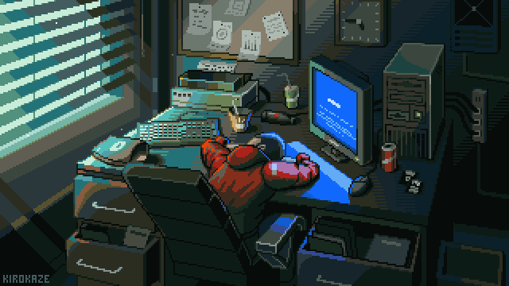

<!-- título -->
<h1 align="center">Hello World 👋</h1>

<!-- Presentation -->

  Hi, I'm <strong>Johnnatan</strong> but you can call me <strong>Johnn</strong>!

  🌱 Currently studying  
  📚 University of Brasília — Software Engineering

<!-- Dropdown -->

  
🦦 More about me

   
  💬 19 years old, living in Brazil.  
  ⚡ I enjoy working with design and styling all my projects.

 

<!-- Links -->

  
  

---

<!-- GitHub Stats -->

  
  

---

## 🌐 Portfolio

  <a href="https://portfolio-jsalles-projects.vercel.app/">
    Johnn Salles Portfolio
  </a>

---

<!-- GIF -->

  

---

## 👨‍💻 Tech Stack

  
  
  
  
  

